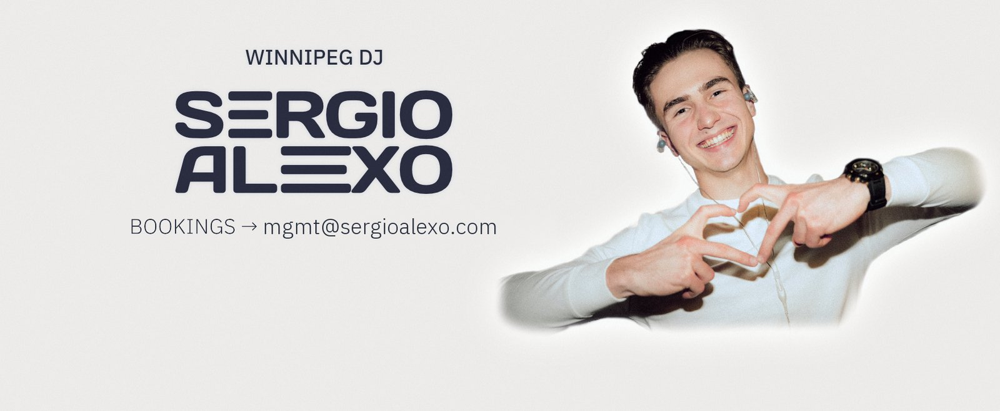
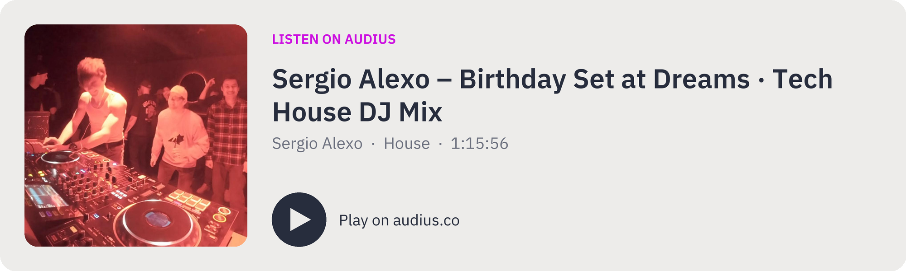
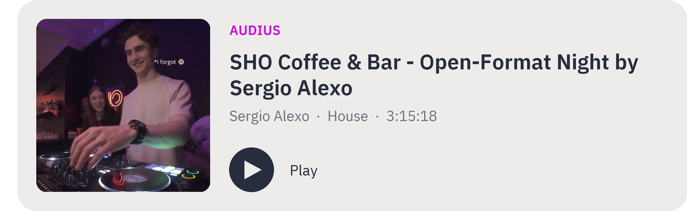
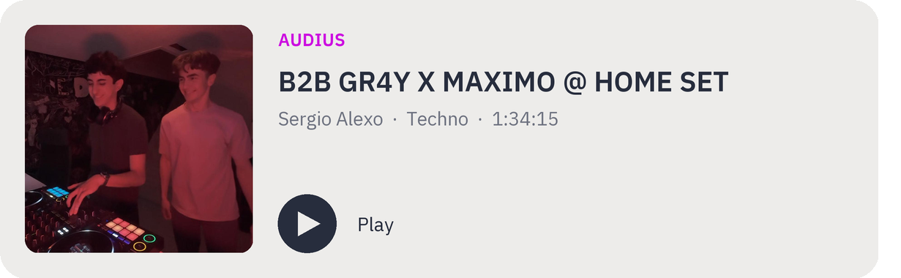

**DJ · Producer · Builder** 
Groovy house & melodic sound — Winnipeg, Canada 🇨🇦 · from Ukraine 🇺🇦

---

## 👤 About

I play **groovy house** with melodic elements — rhythm, atmosphere and energy, in live sets and recorded mixes.

Off the decks I build software: DJ tools, CAD and engineering utilities, and websites. Most of it started as something I needed myself.

---

## 🔊 Listen

More on [Audius](https://audius.co/SergioAlexo) and [SoundCloud](https://soundcloud.com/sergioalexo).

---

## 🎛️ Setup

| | Gear |
|---|---|
| 🎚️ **Controller** | Pioneer DJ **DDJ-1000** — 4-channel rekordbox controller with full-size jog wheels |
| 🔊 **Speakers** | Alto Professional **TS415** — 15" powered PA speakers |
| 💿 **Software** | rekordbox · [Mixxx](https://github.com/sergioalexo/mixxx) |
| 🏷️ **Library** | [music-tag-cleaner](https://github.com/sergioalexo/music-tag-cleaner) — my own tagging & library tool |

---

## 🎧 What I Do

- DJ sets — clubs, events, private bookings
- Recorded & video mixes
- Music curation and track selection
- Brand and visual identity

---

## 🛠️ Things I've Built

**For DJs**
- 🏷️ [**music-tag-cleaner**](https://github.com/sergioalexo/music-tag-cleaner) — clean and standardise audio tags, index your library, match YouTube Music playlists against it, split tracks into stems
- ⬇️ [**MediaFetch**](https://github.com/sergioalexo/mediafetch) — desktop GUI for yt-dlp + FFmpeg (Windows & macOS)

**CAD & engineering**
- 📐 [**Sketchor**](https://github.com/sergioalexo/sketchor) — web-first parametric 2D CAD with a sketch-code DSL and DXF import · [sketchor.sergioalexo.com](https://sketchor.sergioalexo.com)
- ✅ [**RevAudit**](https://github.com/sergioalexo/revaudit) — Onshape release, drawing and production-file (DXF/SAT/PDF/STEP) audit tool
- 🎨 [**coating-calculator**](https://github.com/sergioalexo/coating-calculator) — stain, oil, Resysta and powder coating quantity calculator

**Other**
- ⏱️ [**OpenERP**](https://github.com/sergioalexo/openerp) — self-hosted daily time report app (Next.js + SQLite)
- ᛟ [**slavic-symbols**](https://github.com/sergioalexo/slavic-symbols) — illustrated encyclopedia of Slavic symbols

**Brand**
- 🪪 [Business card](https://github.com/sergioalexo/sergioalexo-business-card) · 📦 [Media kit](https://github.com/sergioalexo/sergioalexo-media-kit) · ✒️ [Logo](https://github.com/sergioalexo/sergioalexo-logo) · 🖼️ [Banner](https://github.com/sergioalexo/sergioalexo-logo/blob/main/banner2-email.jpg)

---

## 🧰 Stack

---

## 🤝 Collaboration

Ideas, issues and pull requests are welcome on any public repo — bug reports, UX suggestions, new features, or your own fork.

## 📬 Bookings

For bookings and collaborations:

- ✉️ **Email:** [mgmt@sergioalexo.com](mailto:mgmt@sergioalexo.com)
- 🌐 **Website:** [sergioalexo.com](https://sergioalexo.com)
- 💬 **Instagram DM:** [@sergioalexoo](https://instagram.com/sergioalexoo)

---

*Building a recognizable sound and visual identity — on and off the dancefloor.*

